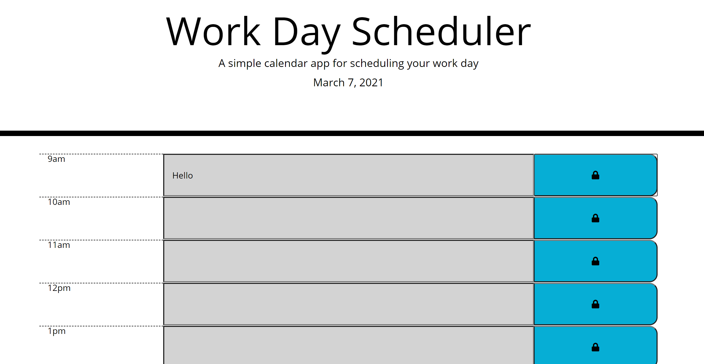

# Homework-5-Scheduler

## Description

This is a simple workday scheduler built using Vanilla Javascript, jQuery, and Moment.js.

The scheduler using the time refrences via Moment.js to display the local time. Javascript was used to record the information in the planner and store it in the local storage by clicking the lock icon. The information will remain on the page even if the page is refreshed. In short, the user is able to save and retrieve the information they input into the scheduler.

The time blocks are color coded in reference to the local time. If the time is in the past, the time blocks will be grayed out. If the time block conincides with the current time, it will be color coded as red. If the time block is in the future, then it will be color coded green.

## Link

https://vegaryanneil.github.io/homework-5-scheduler/

### Resources Used

https://developedbyed.com/

https://www.youtube.com/watch?v=Ttf3CEsEwMQ&t=1486s

Dev By Ed helped me think through some of the functions I wanted to add for the project. My thought process was that a scheduler was a more advanced to-do list, so the tutorial as well as the prior mini-project helped me foundationally understand what needed to be done.

I also utilized Homework-4 Quiz to help set up the local storage and save information.
